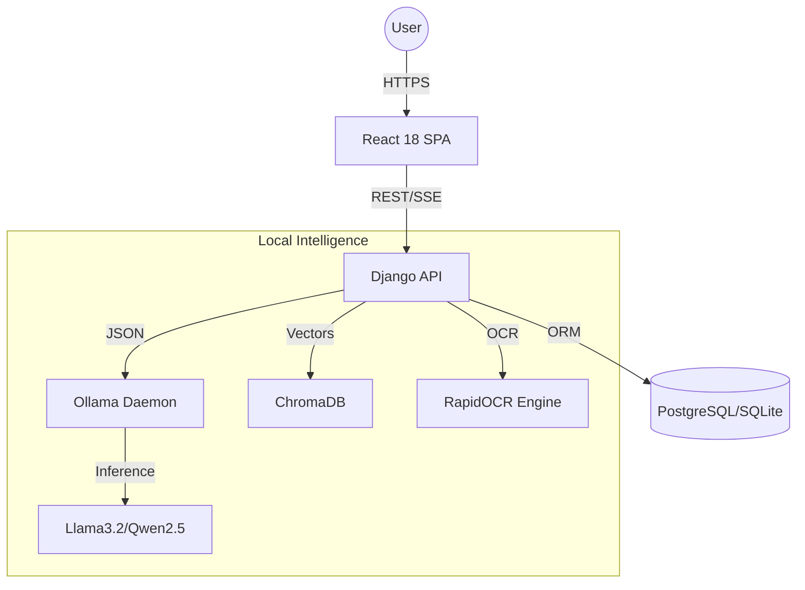

# LLMZK: Advanced Privacy-First Educational Ecosystem

LLMZK is a state-of-the-art, 100% local AI platform designed to transform static course materials into interactive, structure-aware knowledge bases. By leveraging local LLMs (via Ollama), high-fidelity OCR, and vector-based retrieval, it provides a seamless, privacy-preserving learning experience.

---

## 🏗️ System Architecture & Data Flow

LLMZK follows a decoupled architecture using a high-performance Django 5.0 backend and a modern React 18 frontend.



---

## 🚀 Key Features

*   **Structure-Aware RAG:** Identifies hierarchical layouts (Chapters/Lessons) for semantic chunking and precise citations.
*   **Hybrid OCR Engine:** Automatically routes between `pdfplumber` and `RapidOCR` based on confidence scores to handle scanned PDFs.
*   **Automated Course Management:** AI-driven syllabus analysis, topic clustering, and learning objective extraction.
*   **Intelligent Assessment:** Automated generation of MCQs, coding tasks, and real-time AI auto-grading with custom rubrics.
*   **Deep Analytics:** Detects student "Struggle Areas" through question clustering and engagement heatmaps.

---

## 📂 Project Structure

```text
LLMZK/
├── ai-classroom-backend/           # Django Backend
│   ├── apps/                       # Modular Application Logic
│   │   ├── ai_service/             # Core RAG, SSE Streaming, OCR & Prompt Logic
│   │   ├── courses/                # Material Lifecycle & Enrollment
│   │   ├── assignments/            # AI Question Generation & Grading
│   │   └── analytics/chat/users/    # Usage Tracking, History & Custom Auth
│   ├── config/                     # Django Settings & Global URL Routing
│   └── media/                      # PDF Storage & ChromaDB Persistence
├── ai-classroom-frontend/          # React Frontend (Vite)
│   ├── src/
│   │   ├── components/             # ChatInterface, SourceCards, FileUpload
│   │   ├── hooks/contexts/         # useStream (SSE), useApi, AuthContext
│   │   └── pages/                  # Dashboard, CoursePage, AssignmentDetail
└── docker-compose.yml              # Container Orchestration
```

---

## 🧠 Core Intelligence Layer

### The RAG Pipeline
1.  **Ingestion:** PDFs are chunked (~500 tokens) with 10% overlap, cleaned of artifacts, and embedded via `all-MiniLM-L6-v2`.
2.  **Retrieval:** User queries are embedded to perform a Cosine Similarity search in ChromaDB using HNSW indexing.
3.  **Generation:** Context-enriched prompts are streamed via **Server-Sent Events (SSE)** from Ollama for a real-time UX.

### OCR & Extraction
Scanned documents trigger the `RapidOCR` ONNX pipeline, which reconstructs text while preserving spatial positioning. This ensures multi-column academic papers are parsed correctly.

---

## 🛠️ Technical Stack & Requirements

| Layer | Technologies | Min. Requirements |
| :--- | :--- | :--- |
| **Backend** | Python 3.11, Django 5.0, DRF, ChromaDB | 8GB RAM |
| **Frontend** | React 18, Vite, TailwindCSS, TanStack Query | Modern Browser |
| **AI Engine** | Ollama (Llama 3.2, Qwen 2.5) | 4-Core CPU / 8GB VRAM GPU |
| **OCR/NLP** | RapidOCR, Sentence-Transformers | SSD (10GB+ free) |

---

## 🚦 Installation & Setup

### 1. Configure AI Daemon (Ollama)
```bash
ollama serve
ollama pull llama3.2
ollama pull qwen2.5:7b
```

### 2. Backend Setup
```bash
cd ai-classroom-backend
python -m venv venv && source venv/bin/activate
pip install -r requirements.txt
cp .env.example .env
python manage.py migrate && python manage.py createsuperuser
python manage.py runserver
```

### 3. Frontend Setup
```bash
cd ../ai-classroom-frontend
npm install && npm run dev
```

---

## 📡 API & Configuration Reference

### Key Endpoints
*   `POST /api/chat/stream/`: Streams AI tokens + source metadata (SSE).
*   `POST /api/courses/{id}/upload-material/`: Triggers background indexing.
*   `POST /api/assignments/generate/`: Creates structured JSON tests from materials.

### Environment Highlights (.env)
*   `OLLAMA_BASE_URL`: Defaults to `http://localhost:11434`.
*   `OLLAMA_MODEL_PRIMARY`: Primary chat model (e.g., `llama3.2`).
*   `OCR_ENABLED`: Toggle for the RapidOCR pipeline.

---

## 🔧 Troubleshooting & Performance

*   **Empty Chat:** Ensure `ollama serve` is active and the model name matches exactly in `.env`.
*   **Slow Extraction:** Scanned PDFs are CPU-heavy; ensure sufficient cores or offload to GPU via Ollama settings.
*   **CORS Errors:** Verify `http://localhost:5173` is in `CORS_ALLOWED_ORIGINS` in `settings.py`.
*   **Inference Speed:** Use 4-bit quantized GGUF models for optimal performance on consumer hardware.

---

## 🚀 Roadmap & Contributing

*   **Upcoming:** Multi-modal support (diagram analysis), Whisper voice integration, and native mobile apps.
*   **Contribute:** Fork the repo, create a feature branch, and submit a PR. Please adhere to PEP 8 and Prettier standards.

---

<p align="center">
  <b>LLMZK</b> - Privacy-First AI for the Next Generation of Learners.
</p>
